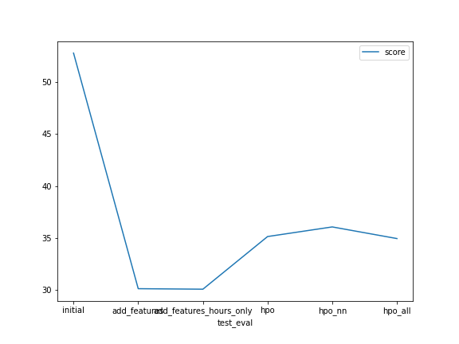
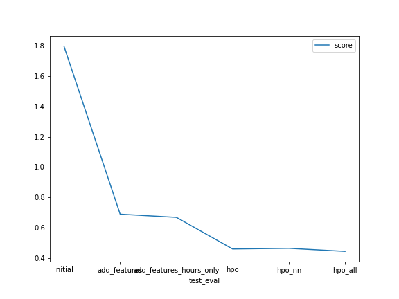

# Report: Predict Bike Sharing Demand with AutoGluon Solution
#### Louis Byers

## Initial Training
### What did you realize when you tried to submit your predictions? What changes were needed to the output of the predictor to submit your results?
First I realized that the test set didn't include 2 features ('casual' and 'registered') that I used to train the initial models. So I had to drop those columns from the training set and retrain the models. I also had to verify that the test set datetime matched the submisttions datetime so the predictions would match up.

### What was the top ranked model that performed?
It was the `WeightedEnsemble_L2` but it seemed marginally better than 2nd place `RandomForestMSE_BAG_L2` or even `ExtraTreesMSE_BAG_L2` at least according the RMSE.

## Exploratory data analysis and feature creation
### What did the exploratory analysis find and how did you add additional features?
I found that no values strongly correlated to count. I saw `atemp` and `temp` were basically the same and highly correlated and both followed a standard distribution. We have 2 categorical values `weather` and `season`, and 2 binary values `holiday` and `workingday`. Also because `datetime` was an `object` it didn't show up in any analysis.

I created features by converting `datetime` and taking all of its component values as individual features. I tried both pulling all the datetime values and also only extracting the `hour` as the other values seemed to be auto found by Autogluon. I also converted the 2 categorical values into category types.

### How much better did your model preform after adding additional features and why do you think that is?
It was in terms of RMSE slightly better than twice as good. While the top model was the same as (I beleive that in most cases some weighted ensemble will be), places 2 and 3 were different, now they were `CatBoost_BAG_L2` and `LightGBM_BAG_L2`. The random forest and extra trees algorithms fell to 5 and 4 respectivvely. I think the additon of the `hour` feature likely played the most important role.

I tried another training run where I only added the `hour ` field as an explicit field and didn't extract the rest of the datetime (cause Autogluon seemed to do it on its own), this actually got ever so slightly better results than the version where every field from `datetime` was explicitly extracted.

I tried a run where I didn't extract the datetime parts and only converted it to a datetime and converted the categories, this feature set did about as the orginal training with no feature engineering.

I also did a run where I didn't convert the categorical fields so they were interpreted as `ints`. I did thoughextract the `hour` field and it showed about the same improvement in performance as when the category fields were type converted, but it wasn't as good.

Here is a table of my findings:
|Categories Extracted|Hour Extracted|Other Date Parts Etracted|highest model score|
|--|--|--|--|
|No|No|No|-52.739146|
|Yes|Yes|Yes|-30.195552|
|Yes|Yes|No|-30.067164|
|No|Yes|No|-30.249268|
|Yes|No|No|-52.474577|

Note: A latter call to `predictor_new_hpo_all.feature_importance(hyper_param_train)` seems to validate that `hour` was the most important feature to add.

## Hyper parameter tuning
### How much better did your model preform after trying different hyper parameters?
It performed roughly 30% better.

### If you were given more time with this dataset, where do you think you would spend more time?
I think I might try some feature engineering with exponential expansion and also potentially just using the scikit random forest
and extra trees algorithms and doing some hyperparameter tuning there. Unfortinately Autogluon did not support tuning their
hyperparams according to their docs.

### Create a table with the models you ran, the hyperparameters modified, and the kaggle score.
|model|hpo1|hpo2|hpo3|score|
|--|--|--|--|--|
|initial|"n/a"|"n/a"|"n/a"|1.79859|
|add_features|"n/a"|"n/a"|"n/a"|0.66854|
|hpo|iterations: 2-10|depth 4-10|grow_policy: 'SymmetricTree', 'Depthwise', 'Lossguide'|0.44415|

### Create a line plot showing the top model score for the three (or more) training runs during the project.

### Create a line plot showing the top kaggle score for the three (or more) prediction submissions during the project.

## Summary
I learned how important feature engineering can be in really boosting a baseline performance metric. From there hyperparmater tuning
is a very good place to spend time to improve performance. I learned it is really important to ensure you are utilizing your final
success metric to judge the performance of a model rather than the model score. In this case because it was a RMSLE evaluation which
punishes under preditction more than over predictions, the RMSE we used for the metric in model training wasn't a true indicator of
the model's final performance.
